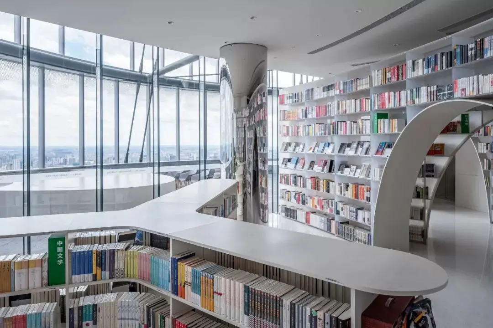

# **🗺️上海**

🕰️ **2024-2-12 —— 2024-2-16**

🌞 **5天**

## day1

✈️ 大兴-虹桥 21:55 —— 23:55

🏨 汉庭（大柏树店） 14日退房

## day2

🏞️ **[武康路文化街](https://www.mafengwo.cn/poi/23338.html)**

🏞️ **三千vintage**

> 店里陈列着店主多年收集的、以宝可梦为主的二次元手办周边，仔细观察能收获不少意外惊喜。

🏙️ **朵云书店 （￥35）**

>  咖啡、上海全景  🔔 需公众号预约 (未来6日 2月8日预约 每日7:00)

⛪ **[豫园](https://www.mafengwo.cn/poi/3889729.html)（￥30）**

⛪ **[城隍庙](https://www.mafengwo.cn/poi/4464.html)**

🌆 **[外滩](https://www.mafengwo.cn/poi/5504076.html)** 

（根据实际情况调整）

## day3

🚄 上海-苏州 08:41 - 09:09

> 🔔 待定 1月31日 14：30抢票

🏛️ **[苏州博物馆](https://www.mafengwo.cn/poi/5674.html)**

> 🔔 需公众号预约 (未来7日 2月8日预约 每日0点)

🏞️ **[金鸡湖景区](https://www.mafengwo.cn/poi/642.html)**

🚄 苏州-上海 21:25 - 21:59

> 🔔 待定 1月31日 16：00抢票

🏨 上海金万莱酒店 (16日退房 车程大概一小时)

## day4

🎠 **[迪士尼](https://www.mafengwo.cn/poi/6102028.html)**

## day5

⛪ [田子坊](https://www.mafengwo.cn/poi/1364.html)

⛪ [思南公馆](https://www.mafengwo.cn/poi/4527.html)

✈️ 虹桥-北京首都 19:00 —— 21:20

## 美食

**生煎**

1.大壶春

> 大壶春的“无汤生煎”是它的一大特色，面皮厚实松软，裹着少少的油水和饱满的馅料

2.东泰祥

**本帮菜**

1.上海老饭店

2.上海德兴馆

## 相关资料

[繁花圣地巡礼](https://imfw.cn/l/315876279)

[电台：如果你来上海，我想带你去这些地方](https://www.xiaoyuzhoufm.com/episode/60d81eb925da4f997b8ba25e)

