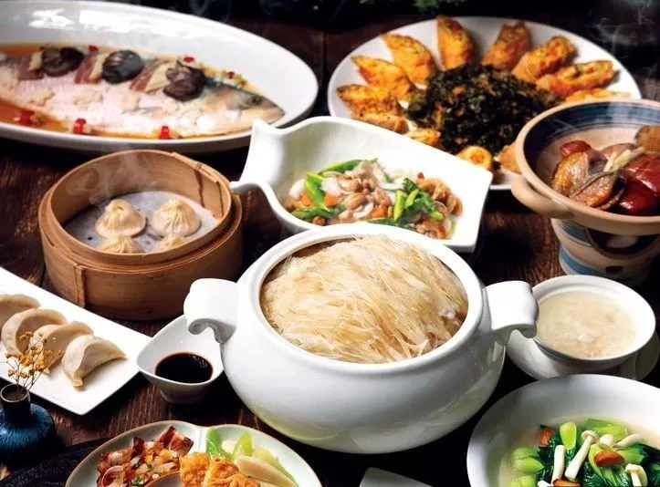

# **🗺️上海**

🕰️ **2024-2-12 —— 2024-2-16**

🌞 **5天**

## 旅行用品

* 一次性浴巾、毛巾

* 电动牙刷+牙膏

* 电动剃须刀

* 雨伞

* 身份证

* 口罩

* 布洛芬与感冒药
* 暖贴

## 花费

| 名称               | 金额  |
| ------------------ | ----- |
| 机场打车到酒店     | 40    |
| 东泰祥生煎         | 53    |
| 打车到晶焱上海菜   | 30.4  |
| 晶焱上海菜         | 212   |
| 寄存柜             | 52    |
| 打车到苏州博物馆   | 22.07 |
| 听雨轩苏州菜       | 168   |
| 草莓               | 15    |
| BC黄油面包         | 82    |
| 豆浆鸡蛋           | 16.5  |
| 苏州回来打车到酒店 | 74.24 |
| 迪士尼优先通道     | 720   |
| 山石榴             | 364   |
| 朵云书店饮品       | 93    |
| 宾馆购物机         | 11.44 |
| 迪士尼附近宾馆     | 376   |
| 沪上阿姨           | 29.5  |
| 打车到苏州中心广场 | 19.52 |
| 上海酒店           | 576   |
| 耦园门票           | 20    |
| 北京地铁购物机     | 16    |
| 机票               | 2238  |
| 迪士尼小象超市     | 95.98 |

## day1

✈️ 大兴-虹桥 21:55 —— 23:55

🏨 酒店 14日退房

## day2

🏞️ **[武康路文化街](https://www.mafengwo.cn/poi/23338.html)**

🏞️ **三千vintage**

> 店里陈列着店主多年收集的、以宝可梦为主的二次元手办周边，仔细观察能收获不少意外惊喜。

🏙️ **朵云书店 （￥35）**

>  咖啡、上海全景  🔔 需公众号预约 (未来6日 2月8日预约 每日7:00)

⛪ **[豫园](https://www.mafengwo.cn/poi/3889729.html)（￥30）**

⛪ **[城隍庙](https://www.mafengwo.cn/poi/4464.html)**

🌆 **[外滩](https://www.mafengwo.cn/poi/5504076.html)** 

（根据实际情况调整）

## day3

**🚄 上海-苏州园区 08:25 - 08:49**

**经典路线**

> 如果你第一次来苏州，那么这是一条非常推荐的步行路线。参观完拙政园片儿区，就上**平江路**，一直向南走到**干将东路**，别忘了把主路旁的小巷也逛一逛，特别是中张家巷和大柳枝巷；之后继续向南走到**凤凰街**，经**十梓街**到苏州大学，然后由**十全街**到网师园，继续向西南方向行走，途径沧浪亭，最后走上**新市路**，到达盘门。

**苏州美食主要集中在观前街、平江路、山塘街、十全街一带。**

🏛️ **[苏州博物馆](https://www.mafengwo.cn/poi/5674.html)**

> 🔔 需公众号预约 (未来7日 2月8日预约 每日0点)

🏞️ **[拙政园](https://www.mafengwo.cn/poi/642.html)**（￥70）

🏞️ **[平江路](https://www.mafengwo.cn/poi/642.html)**

🏞️ **[沧浪亭](https://www.mafengwo.cn/poi/642.html)**（￥15）

> 苏州“小”园林，首推**沧浪亭**，园中只有寥寥游人与画匠，可尽情欣赏108式花窗与“清风明月本无价，近水远山皆有情”的田园意趣；隐匿在巷子深处**艺圃**堪称苏州园林最高性价比，素雅朴实的画风透露着恬淡之美；**环秀山庄**小巧玲珑，还有精美的苏绣可以欣赏；你还可以去**耦园**寻“佳偶”，看清代恩爱夫妻相伴终老之所。
>
> 虽不是世界遗产，**怡园**里的假山还能随意攀爬，**朴园**清净无人打扰，**五峰园**可像当地人一样喝茶话家常……这些园子清幽，门票也不贵，有的还免费，静静的坐上半日，不管是冥思还是品茶，都能让人体会苏州园林中无处不在的微妙之趣。

🏞️ **[虎丘山风景名胜区](https://www.mafengwo.cn/poi/642.html)**

> 新春特惠 每人30￥ 大众点评已购买

🏞️ **[山塘街](https://www.mafengwo.cn/poi/642.html)**

🏞️ **[金鸡湖景区](https://www.mafengwo.cn/poi/642.html)**

> 19:30 20:30 两场音乐喷泉

**🚄 苏州-上海 21:25 - 21:59**

**🏨 酒店 (16日退房 车程大概一小时)**

## day4

🎠 **[迪士尼](https://www.mafengwo.cn/poi/6102028.html)**

> 生日当月前来上海迪士尼乐园，凭本人有效身份证件前往游客服务中心，有机会免费领取生日徽章一枚。每位游客每次只可领取一枚生日徽章，徽章每日发放数量有限，先到先得，领完即止。

## day5

⛪ [田子坊](https://www.mafengwo.cn/poi/1364.html)

⛪ [思南公馆](https://www.mafengwo.cn/poi/4527.html)

✈️ 虹桥-北京首都 19:00 —— 21:20

## 美食

**生煎**

1.大壶春

> 大壶春的“无汤生煎”是它的一大特色，面皮厚实松软，裹着少少的油水和饱满的馅料

2.东泰祥

**本帮菜**

1.上海老饭店

2.上海德兴馆

## 相关资料

[繁花圣地巡礼](https://imfw.cn/l/315876279)

[电台：如果你来上海，我想带你去这些地方](https://www.xiaoyuzhoufm.com/episode/60d81eb925da4f997b8ba25e)

[苏州十大看点，让你遇到雅致江南 - 马蜂窝](https://www.mafengwo.cn/gonglve/ziyouxing/98398.html)
