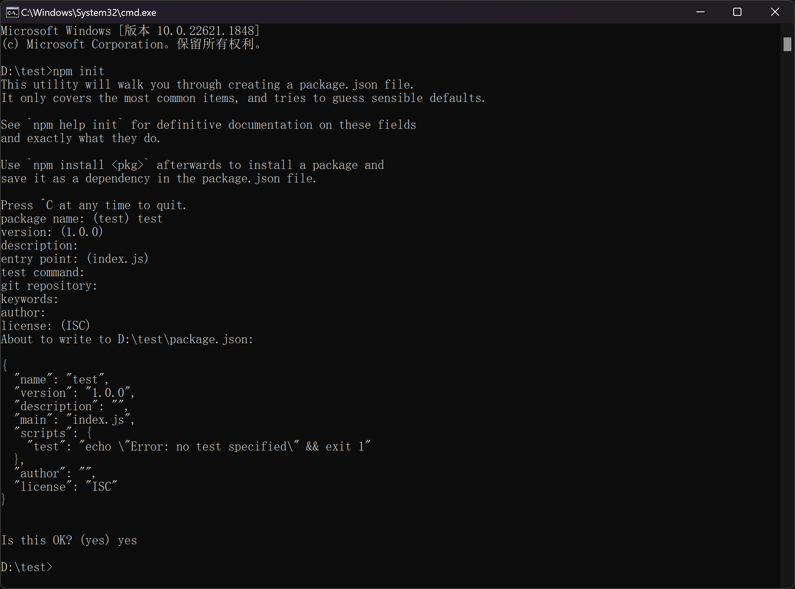
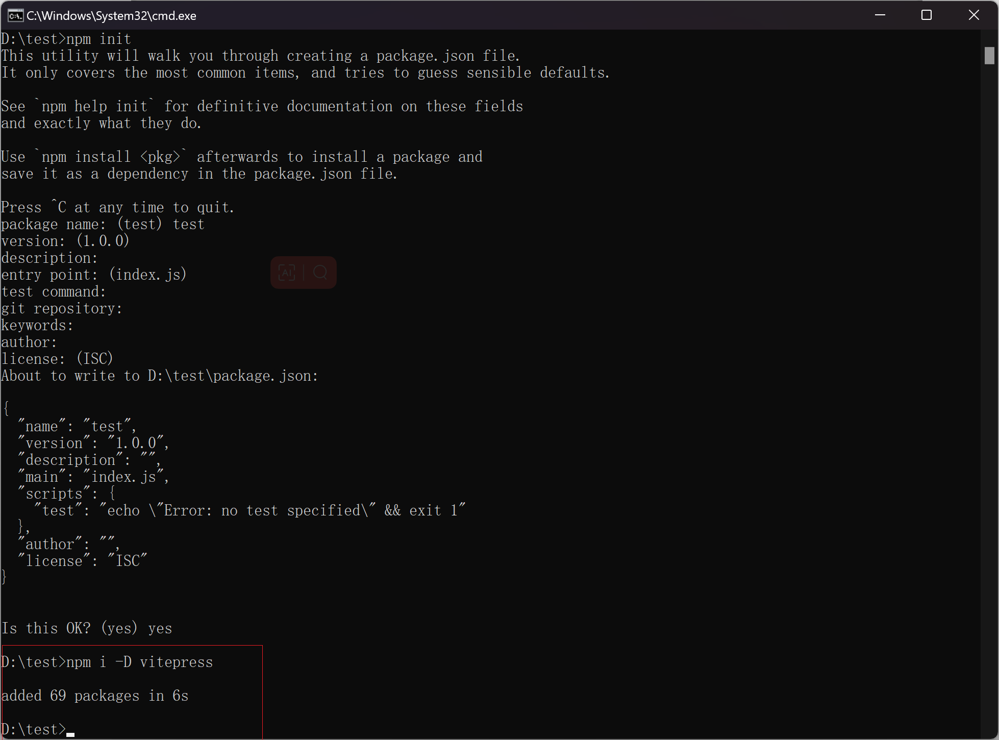
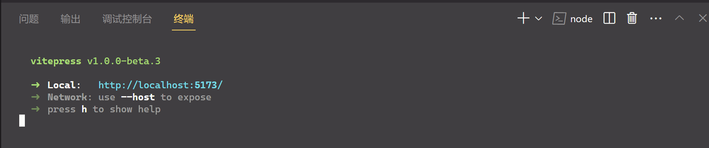
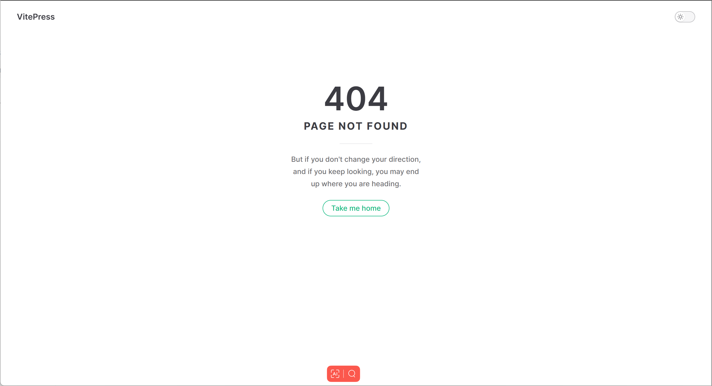
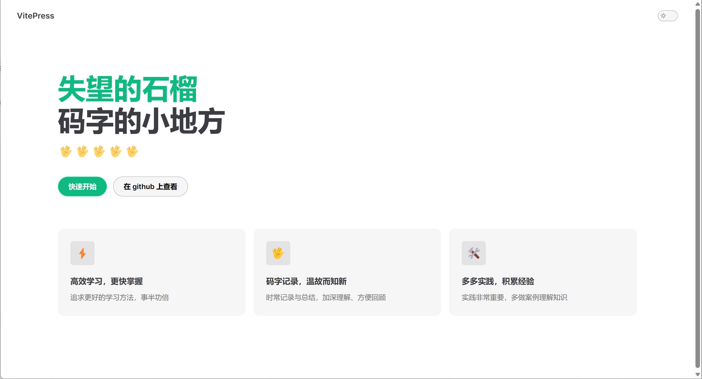
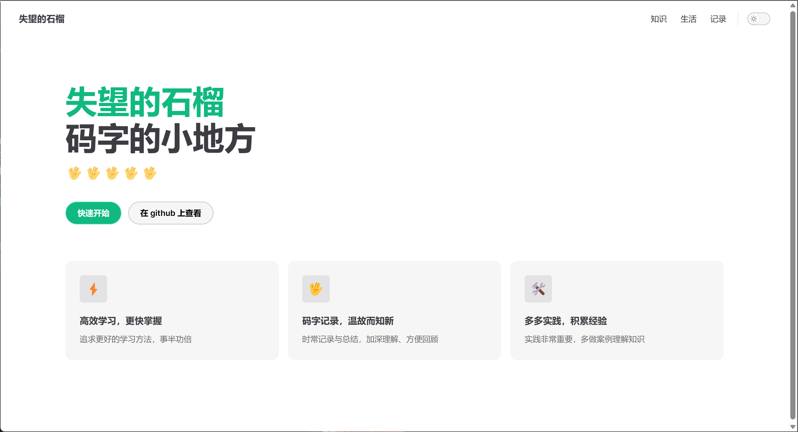
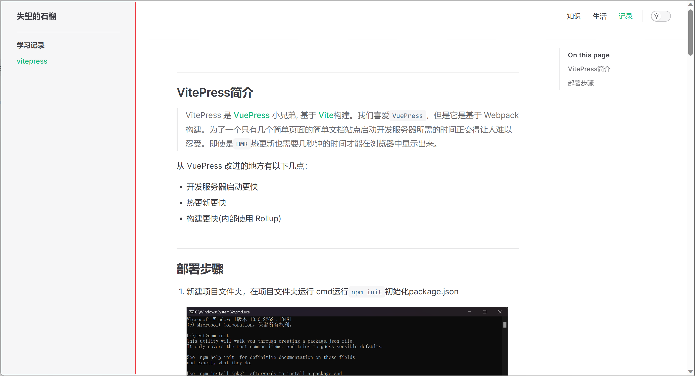
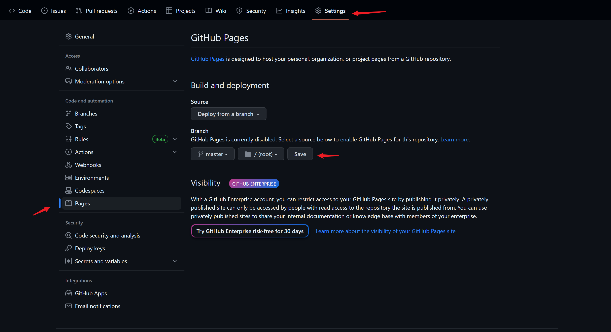
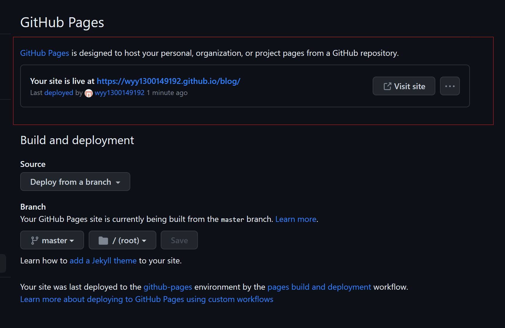

## VitePress简介

> VitePress 是 [VuePress](https://vuepress.vuejs.org/) 小兄弟, 基于 [Vite](https://github.com/vitejs/vite)构建。我们喜爱`VuePress`，但是它是基于 Webpack 构建。为了一个只有几个简单页面的简单文档站点启动开发服务器所需的时间正变得让人难以忍受。即使是`HMR`热更新也需要几秒钟的时间才能在浏览器中显示出来。


从 VuePress 改进的地方有以下几点：

- 开发服务器启动更快
- 热更新更快
- 构建更快(内部使用 Rollup)


## 部署步骤

1. 新建项目文件夹，在项目文件夹运行 cmd运行`npm init`初始化package.json

   

   

2. 继续运行`npm i -D vitepress`安装VitePress

   


3. 在`package.json`中添加脚本

   ```
     "scripts": {
       "docs:dev": "vitepress dev docs",
       "docs:build": "vitepress build docs",
       "docs:serve": "vitepress serve docs"
     }
   ```

   


4. 运行 `npm run docs:dev`




5. 打开local，会看到404，因为并未找到主页

   


6. 接下来新建首页页面：在`docs`文件根目录下创建 `index.md`

   ```markdown
   ---
   layout: home
   
   hero:
     name: 失望的石榴    # 标题
     text: 码字的小地方    # 副标题
     tagline: 🖖🖖🖖🖖🖖 # 标语
     image:
       src: /logo.png
       alt: logo图片
     actions:
       - theme: brand
         text: 快速开始
         link: /guide/what-is-vitepress
       - theme: alt
         text: 在 github 上查看
         link: https://github.com/wyy1300149192
   features:
     - icon: ⚡️
       title: 高效学习，更快掌握
       details: 追求更好的学习方法，事半功倍
     - icon: 🖖
       title: 码字记录，温故而知新
       details: 时常记录与总结，加深理解、方便回顾
     - icon: 🛠️
       title: 多多实践，积累经验
       details: 实践非常重要，多做案例理解知识
   ---
   
   
   ```

   

   页面预览：

   


7. 页面路径规则，vitepress页面根路径为`docs`文件夹

   如`/knowledge/Css`则文件路径：

   ```
   .
   ├─ docs
   │  ├─ .vitepress
   │  │  └─ config.js
   |  ├─ knowledge
   |  |  └─ Css.md
   │  └─ index.md
   └─ package.json
   ```

   

8. 在 `docs/.vitepress/`路径下创建`config.js`配置文件，设置整个网站的配置

   ```js
   module.exports = {
       // 网站标题
       title: '失望的石榴',
       // 网站描述
       description: 'God help those who help themselves.',
       // 根地址 静态资源根地址
       base: '/blog/',
       head: [
           // 网站图标
           ['link', { rel: 'icon', href: '/favicon.ico' }]
       ],
       // 主题
       themeConfig: {
           nav: [
               { text: '知识', link: '/knowledge/Css' },
               { text: '生活', link: '/life/travel' },
               { text: '记录', link: '/rec/vitepress' },
           ],
           sidebar: { // 侧边栏，可以分组
               "/knowledge/": [
                   {
                       text: "前端知识",
                       items: [
                           {
                               text: "Css",
                               link: "/knowledge/Css",
                           },
                           {
                               text: "Html",
                               link: "/knowledge/Html",
                           }
                       ],
                   },
               ],
               "/life/": [
                   {
                       text: "生活点滴",
                       items: [
                           {
                               text: "旅行",
                               link: "/life/travel",
                           },
                           {
                               text: "酒",
                               link: "/life/wine",
                           }
                       ],
                   },
               ],
               "/rec/": [
                   {
                       text: "学习记录", // 侧边栏标题
                       items: [
                           {
                               text: "vitepress", // 侧边栏项标题
                               link: "/rec/vitepress", // 侧边栏地址
                           }
                       ],
                   },
               ],
       
           },
       },
   }
   ```

   

   

   主题配置 `themeConfig`对象中可配置**头部右上导航栏（nav）**和**侧边导航栏（sidebar）**

   

   `nav`为一个数组，里面每一个对象对应一个导航栏项目

   ​	- text：导航标题

   ​    - link：导航地址

   ```js
           { text: '知识', link: '/knowledge/Css' },
           { text: '生活', link: '/life/travel' },
           { text: '记录', link: '/rec/vitepress' },
   ```

   

   

   `sidebar`为一个对象，对象key为设置在哪个**路径**下显示侧边栏，**value**设置**侧边栏标题**和**侧边栏项目**

   ```js
   sidebar: { // 侧边栏，可以分组
               "/rec/": [
                   {
                       text: "学习记录", // 侧边栏标题
                       items: [
                           {
                               text: "vitepress", // 侧边栏项标题
                               link: "/rec/vitepress", // 侧边栏地址
                           }
                       ],
                   },
               ],
       
           }
   ```

   


9. 接下来利用github部署网站

   1）创建仓库

   2）打开`Settings`页面

   3）进入`Pages`页签

   4）在Branch处选择分支，点击`Save`

   

   点击`Save`后等待一会，创建完成将显示以下提示。表示创建成功

   

10. 在项目根目录增加`deploy.sh`，方便一键部署

    ```sh
    # 确保脚本抛出遇到的错误
    set -e
    
    # 打包生成静态文件
    npm run docs:build
    
    # 进入 dist 目录
    cd docs/.vitepress/dist
    
    # 提交
    git init
    git add .
    git commit -m 'deploy'
    
    # 部署网站 git push -f 仓库 分支
    git push -f https://github.com/wyy1300149192/blog.git master
    
    # 提交所有代码到github
    cd ../../../
    git add .
    git commit -m 'update'
    git push
    ```

    

至此，成功使用VitePress完成部署了一个简易的博客网站